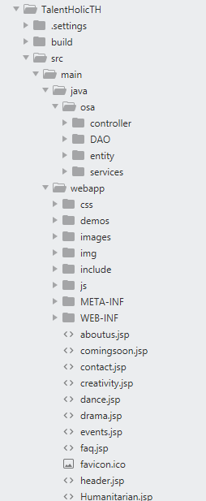

# TalenHolic

It is a  a website which provides you the perfect platform to showcase your talents.
The ides is to create a platform for intra-college or inter-college societies where students as well as socieites can:
- Create their profile
- Upload their Photos, Videos, Texts etc.
- Like or comment them
- Societies can create events.
- Approach each other for events.

### SERVER

- The Server-side programming technology used is `JSP`.
- Cloud Datastore is used as database.

### FRONT-END

- The Front-end is made with `HTML, CSS and JS`.
- `Bootstrap` is used for better styling of the project.
- `Canvas` template from Themeforest is used to provide better User Interface.

### MISC

- The Web App is deployed on [Google Cloud](https://www.googleadservices.com/pagead/aclk?sa=L&ai=DChcSEwiutJLPpdDkAhVCJCsKHc--C_gYABAAGgJzZg&ohost=www.google.com&cid=CAESEOD2BzI0YzMUQJNmVhxh6kk&sig=AOD64_0_pdQaV1V-zRLaxpa-ZQzR_134dw&q=&ved=2ahUKEwiHq4nPpdDkAhVEinAKHdSSAV4Q0Qx6BAgSEAE&adurl=).
- Image storage is handled using [BlobstoreService](https://cloud.google.com/appengine/docs/standard/java/javadoc/com/google/appengine/api/blobstore/BlobstoreService).
- [Mail API](https://cloud.google.com/appengine/docs/standard/go/mail/sending-receiving-with-mail-api) has been used for sending emails to the users.

### Directory Structure of the project

### JSP Lifecycle
- Translation of JSP to Java (servlet).
- Compilation of java to .class.
- Loading of servlet class.
- Instantiation(no-arg constructor).
- Initialization(init method).
- Invoke service() method in a new thread of execution(which in turn invoke doXXX methods).
- Destroy(destroy method)

### To-Do

- To implement this project , either import the project source code in eclipse ide environment.
- Or alternatively you can import the war file to eclipse and then run the project.
- Run main.jsp as the starting page
